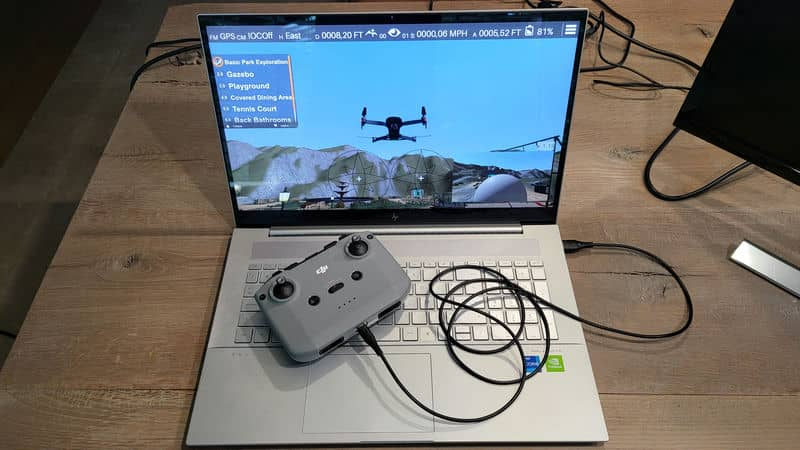
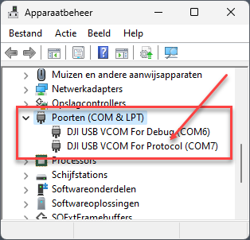

# DJI RC-N1 as Xbox 360 Controller

This script turns your **DJI RC-N1 controller** into an **Xbox 360 controller**, so you can use it with your favorite drone simulator.



## Installation

1. Only for Mac users: first install the [Xbox 360 Controller driver](https://www.google.com/search?q=xbox+360+controller+driver+mac&oq=xbox+360+controller+driver+mac+os) for your OS version (not tested yet).
2. Download and install [DJI Assistant 2 (Consumer Drones Series)](https://www.dji.com/be/downloads/softwares/dji-assistant-2-consumer-drones-series)  
This is only needed to install the DJI drivers for the controller.  
IMPORTANT: **DO NOT** run this script while DJI Assistant 2 is running!
2. Download and install [Python 3.x.x](https://www.python.org/downloads/).
3. Install the required packages for this project: `pip3 install vgamepad pyserial python-dotenv colorama`.

## How to use

1. Connect your DJI RC-N1 controller to your computer via the USB-C port <b style="color: darkred">ON THE BOTTOM PORT</b> (the port between the two joystick holders) of the controller.
2. Power on the controller.
3. Run `python dji.py` from the terminal to start the script.  


4. Click `Ctrl+C` on Windows or `Cmd+C` on Mac to stop the script.

**TIP**: test if the controller works with the [Gamepad Tester](https://gamepad-tester.com/).  
Move the joysticks and the Camera Control Dial to see if the buttons are activated.

## Customization

Besides the two joysticks, only the **Camera Control Dial** is accessible through the script.  
By default, the Camera Dial is mapped to the **A** (dial all the way to the left) and **B** (dial all the way to the right) buttons of the Xbox controller.  
In the `.env` file you can change the connection speed ( the `baud rate`) and the Camera Dial mapping.

```bash
# possible values for BAUD_RATE are: 9600 (slowest), 19200, 38400, 57600, 115200 (fastest)
BAUD_RATE=115200

# possible values for Xbox controller are:
# A, B, X, Y, START, BACK, LB (left bumper), RB (right bumper), LT (left trigger), RT (right trigger)
CAMERA_RIGHT_BUTTON=B
CAMERA_LEFT_BUTTON=A
```

## Troubleshooting

1. You have installed the drivers for the controller with DJI Assistant 2 (Consumer Drones Series)?
2. Your controller is connected to your computer via the USB-C port **ON THE BOTTOM** of the controller?
3. Use a **good quality USB-C cable** (not all cables are capable of data transfer, some of them are from poor quality and maybe the cable is just to long).<br>
Try different cables or lower the baud rate in the `.env` file.

If all of the above is correct, you should see the controller as **"DJI USB VCOM For Protocol (COMx)"** in the device manager of Windows under "Ports (COM & LPT)"<br>


## Simulators tested

- [Zephyr](https://zephyr-sim.com/)
- [DJI Fly Simulator](https://www.dji.com/be/downloads/products/simulator)
- [DroneSimPro](https://www.dronesimpro.com/)

## Credits

This script is based on the [Matsemann/mDjiController](https://github.com/Matsemann/mDjiController) script with extra features to customize the mapping of the Camera Control Dial.

## Contributors
- [Maaciej](https://github.com/Maaciej)
- [Konrad Iturbe](https://github.com/KonradIT)

## Change log

### **1.0.11** (2023-08-31)
- More stable and with position status report.
  
### **1.0.1** (2023-07-02)
- Fallback for Windows 11: port must be configured before it can be used.

### **1.0.0** (2023-06-20)
- First release
